# Java 9 Modular Development (Part 2)

https://dzone.com/articles/java-9-modular-development-part-2

Get a look at how to develop, package, and run modules in Java 9, including how the Jlink tool works and an overview of JMOD files.

In my [previous post](#), we discussed modularity, module descriptors, and the details about module-info.java files. This article will help in developing a modular project step by step and packaging them as JARs and JMODs and also describes the steps needed to create runtime images by using jlink.

We will be developing a small modular project that will print, "Hello Welcome to Java 9 Modularity" in the console.

## Project Structure

Create the following structure:

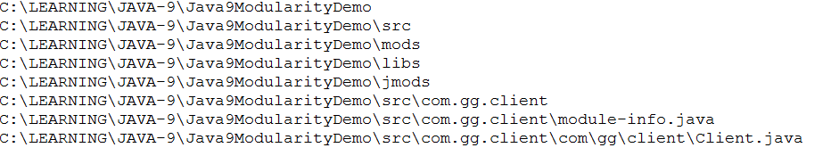

In the above structure, the src folder is used to create source files, the mods folder is used to place all the compiled class files, the libs folder is used to place the created JARs, and the jmods folder is for placing the packaged jmod files.

Every module has a module-info.java file, which is the module descriptor file to define dependencies. (Refer to my [previous post](#) for details.) 

```java
module com.gg.client{

}
```

By default, the module's descriptor file is provided by the java.base module. Tha is why it is not mentioned in the code.

In our example, the Client.java file is the placeholder for the logic and the contents are shown below. If we are going to use any other modules in this one, it should be mentioned in the com.gg.client module descriptor file.

```java
package com.gg.client;

public class Client {

    public static void main(String[] args) {

        System.out.println("Hello Welcome to Java 9 Modularity");

    }

}
```

## Compiling the Source Code

The project we have developed above is compiled using the Java compiler (`javac`) command, as shown below. Also, save the compiled class files in the mods directory. The `javac` command is in the JDK_HOME\bin directory.

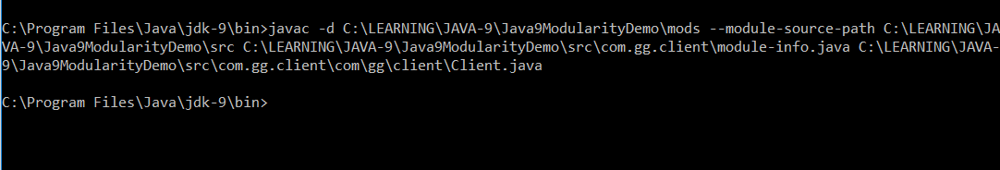

The `javac` command is used to compile the project, -d is used to specify the directory to place the compiled class files, and --module-source-path is used to define the source file location.

As we mentioned above, the java.base module is added by default as a dependency to all application modules. The below snapshot describes this by disassembling the class files via the `javap` command.

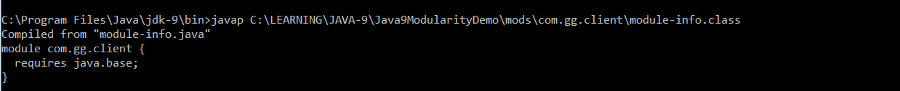

We haven't mentioned the `requires` statement in our code, but it added the `requires` statement on its own.

## Running the Project

The `java` command is used to run the client, where --module-path specifies the module's location and --module defines the module we have to run.Outcome of this is, it prints "Hello Welcome to Java 9 Modularity"

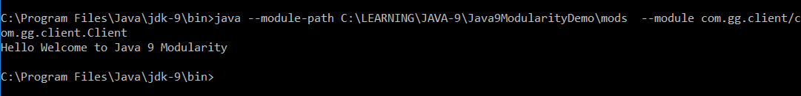

## Packaging the Module Code: JAR

The `jar` command is used to create a JAR file, which is located in the JDK_HOME\bin directory. The '.' in the command is used to specify the current directory.

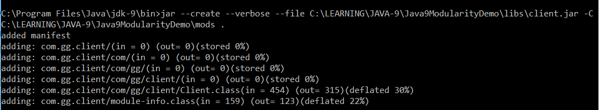

## Multi-Release JARs

Java 9 introduced the multi-release JAR. Multi-release JARs are a single JAR containing the same release of a library for multiple JDKs.

Example:

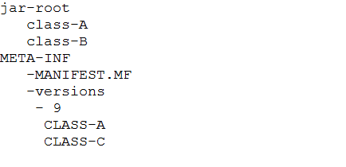

The JAR contains the class files and the MANIFEST.MF file. The multi-release JAR has the version-specific class files the under META-INF directory. The classes specific to the JDK 9 will be in the /META-INF/versions/9 directory. The environment using a multi-release JAR will first check its version and use the classes that are all placed in that version. If the classes for that version are not available, then classes in the root directory will be used.

The main advantage of a multi-release JAR is used to take advantages of the newer releases.

The below snapshot describes the command for creating a multi-release JAR file from the classes which we have compiled in the previous steps. In addition to that, we have placed one Java 8 class file (Client8.class) in the builder8 directory to explain the multi-release JAR.


The --create command is used to create the JAR while the --verbose command is added to check the operations happening behind the screen. --file specifies the name of the JAR file and --module-version specifies the version of the module. We can add the version to the module at the time of creation and not in the module descriptor file.

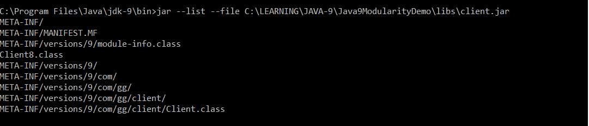

--list is used to list all files in the JAR.

The following snapshot is for running the JAR file.

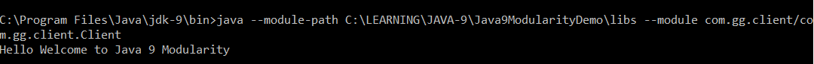

## Creating jmod Files From Modules

Java 9 uses the jmod tool to package all the platform modules. So, in this section, we are packaging our modules as jmod files using the jmod tool.The jmod tool is available in the JDK_HOME\bin directory.

The `create` sub-command is used to create the jmod file. We can also set the --module-version to set the version that will be recorded in the module-info.class file.

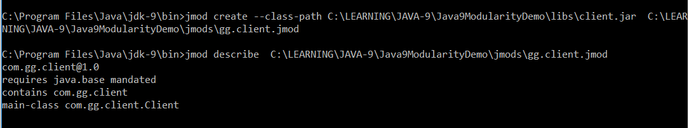

In the above command, the 'create' option is used specify the operation, --class-path is used to specify the JAR file location and then followed by the name of the jmod file with the extension as jmod.

The gg.client.jmod file is created in the jmods directory of the project, and the `jmod describe` command is used to describe the jmod file. We can use the same command to describe the platform modules.

The other options are extracting the jmod file and listing its contents of. The following snapshot will show an example.

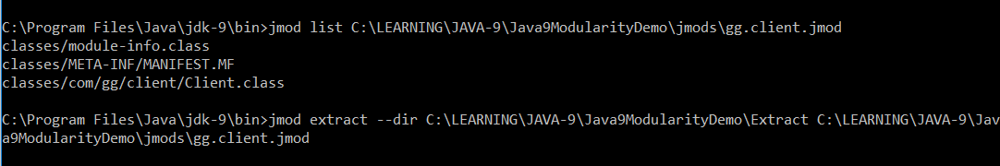

## Jlink

The Jlink tool is used to create custom, platform-specific runtime images, where the runtime images contain the specified application module and the required platform modules. The good thing about Jlink is needing to have the complete JRE. JDK 9 ships with the Jlink tool, which is available in the JDK_HOME\bin directory.

But do we need to have all the classes (like security and logging) to print "Hello world"? The answer is no, but we used to load all the classes through Java 7. In Java 8, Oracle developers made an attempt to come up with the concept of compact modules (compact profiles). But even with compact profiles, we still have some unwanted classes. Sure, it was better than before, but in Java 9, Jlink is used to run only the required modules.

Jlink's main intention is to avoid shipping everything and, also, to run on very small devices with little memory. By using Jlink, we can get our own very small JRE.

Jlink also has a list of plugins that will help optimize our solutions.


The details for each plugin and options in the Jlink tool will be covered in upcoming articles.

To create the Jlink portable java command with simple options, the following general syntax will be used:

```java
jlink --module-path <modulepath> --add-modules <modules>  --output <path>
```

Here, module-path gives the module path locations, which will be separated by : in Linux and ; in Windows. Finally, --add-modules specifies the modules that need to be added, and --output specifies the output path.

On executing the above command, we will be able to get the output in the specified path. The output package is shown below: 

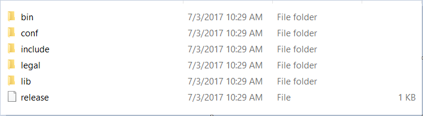

If we look in bin, we will get our own little Java world.

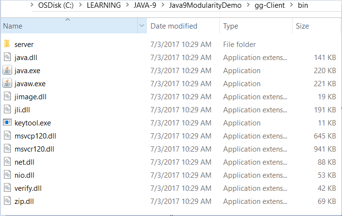

## Running the Program

Now the portable `java` command will be used to run our program. Listing the modules will display only the required modules.

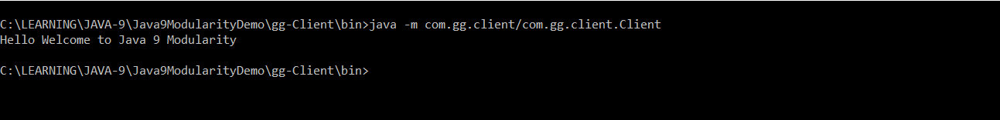

**Note**: Configuring the services and hashing the modules will be described in upcoming articles.
