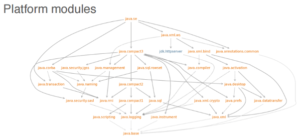
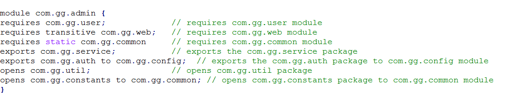
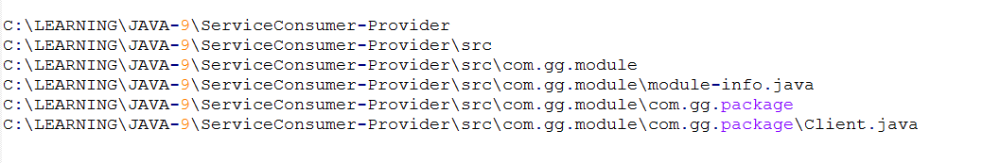

# Java 9 Modular Development (Part 1)

https://dzone.com/articles/java-9-modularity-jigsaw

Get a glimpse of how to put Java 9's modularity to work, including overviews of module types and module descriptors as well as best practices and advice.

Modularity is a way of writing and implementing a program as a number of unique modules. It avoids monolithic design, and it helps in reducing a system's complexity, minimizing coupling, and a few other features.

Java 9 modularity has been a big project of around 5 years of work that will change a lot of what we do today.

## Why Do We Need Modularity?

1. To avoid small devices running the full JDK unnecessarily. Java 9 solved this by having the Jlink tool with the modularity concept.
2. Even in larger machines, space is important, so we should use it effectively.
3. To remove the flaws in encapsulation. In Java 9, Public is no longer visible unless it is exported in module-info.java. It checks dependencies — both the compile time and runtime. Even with reflection, we cannot access when it is not exported.
4. To make our implementation hidden and expose it through interface. So, we can hide the implementation.
5. Improve security and maintainability. To keep internal APIs from using it. Today, we see untrusted code using work, eg : sun.* , *.internal.*
6. To improve performance.

Note: Change from class-path to module-path

## Java 9 Modules

A module is nothing but a module-info.java file that is called as a module descriptor. It describes our module, hence it is called the module descriptor. The name of the module should be unique.

It explains:

1. Which other modules our module depends on.
2. Which packages are to be exported to be used by other modules

## Module Types

There are different types of modules, listed below with their descriptions:

- **Application modules**: The modules that we create to achieve functionality. All third-party dependencies will fall into this category.
- **Automated modules**: JARs placed in the module path without the module descriptor are called automated modules. They implicitly export all the packages and read all other modules. The main purpose of these modules is to use pre-Java 9 build JARs. It removes the file extension and the trailing version number and also replaces all the non-alphanumeric characters with dots to define the module name. Example: mysql-connector-java-6.1.6.jar to mysql.connector.java
- **Unnamed modules**: All the JARs and classes on the class path will be in unnamed modules (the class path is not completely removed ). It does not have any name and so it can read and export all the modules.
- **Platform modules**: The JDK itself has been migrated into a modular structure. Those modules are called platform modules. Example: java.se , java.xml.ws

Java.base is the module every module is dependent on it.

## Module Descriptors

Java modules have module descriptors, i.e module-info.java, which defines the rules for exporting packages and reading the modules. By default, every module can read the java.base module. It's recommended that module names use a reverse-domain pattern.

Detailed explanations of module descriptors are below:

- **requires <module>**

The requires command in the module descriptor is used to define modules in which this module is dependent on.

- **requires transitive <module>**

The transitive keyword says, "Whatever I have will be given to a module that asks me."

- **requires static <module>**

The static keyword is used to say, "This dependency check is mandatory at compile time and optional at runtime."

- **exports <package-name>**

The module exports the package to other modules. If the package is not exported, other modules cannot use this package.

- **exports <package-name> to <module-name>**

This export is called a qualified export. It is exporting the package to a specific module and not all the modules.

- **opens <package-name>**

Opens is used to access this package through Reflection in runtime, to access the public type at compile time, and the private type at the runtime.

- **opens <package> to <module>**

This is a qualified open and is used to access this package through Reflection in runtime by only the specified module.

- **Uses and Provides:**

**Uses** <service-interface>: The interface is in this module and implementation can be in this module or some other module.

**Provides** <service-interface> with <class1>,<class2>: The implementation is mentioned for the interface.

## Important Points

1. The module can also be open.
2. We cannot use the open statement inside the open module.
3. We cannot add the version to the module in module-info.java, but we can do it while building the JAR, which is added to the module info.

## Example

## Package Structure

The sample project structure is given below for the module-based project.

Part 2 will describe in depth how to package modules as JARs, jmod, and jlink.

